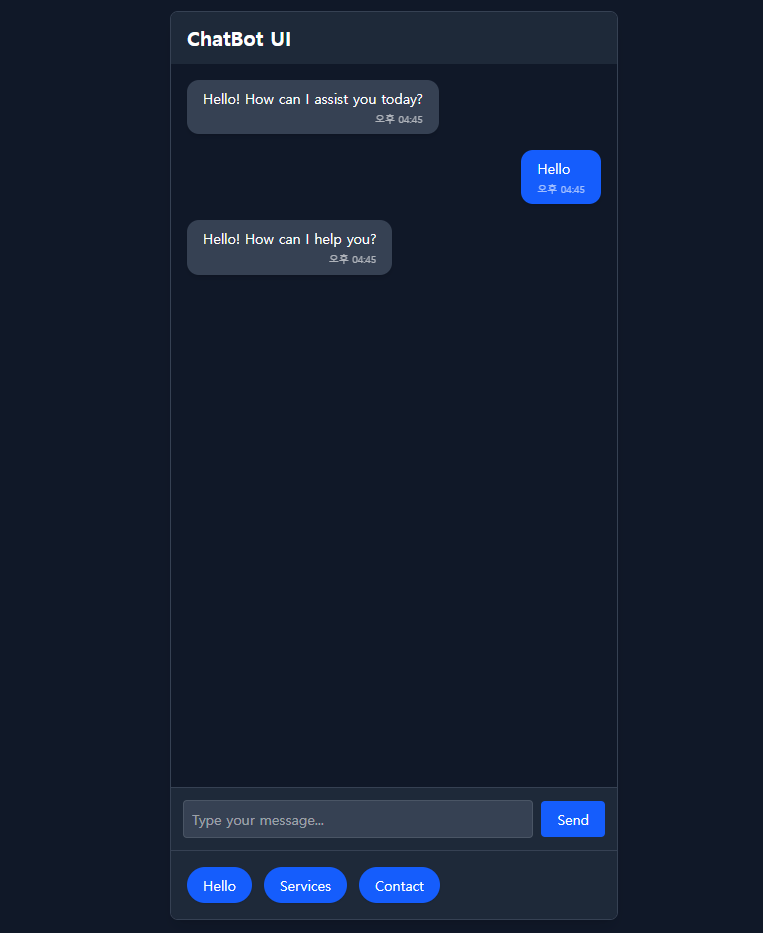

# ChatBot UI

[🇰🇷 한국어 README](./README.kr.md)

A **React-based** static chatbot interface with predefined responses.  
Built with **Vite** and styled using **Tailwind CSS**, this project offers a modern, clean, and responsive user experience — perfect for portfolios and frontend practice.

## 🧠 Features

- Modern and premium chat UI design
- Fully responsive (mobile & desktop)
- Predefined responses via buttons
- User message input with instant reply
- "Typing..." animation for realistic feel
- Built with **Vite** for blazing-fast development
- Styled using **Tailwind CSS** utility-first classes
- Ready for integration with OpenAI or other AI APIs

## 📸 Preview



## 🚀 Getting Started

### Prerequisites

- **Node.js** and **npm** installed on your machine

### Installation

```bash
git clone https://github.com/DevFayzullo/chatbot-ui.git
cd chatbot-ui
npm install
```

### Run in Development Mode

```bash
npm run dev
```

## 🌐 Live Demo

👉 [Click here to view the live demo](https://DevFayzullo.github.io/chatbot-ui)

## 🛠️ Tech Stack

- **React 19**
- **Vite**
- **Tailwind CSS 4**
- **JavaScript (ES6+)**
- **ESLint**
- **gh-pages** (for deployment)

## 📄 License

This project is licensed under the **MIT License**.

---

📌 Developed by **DevFayzullo**

> “Great things are not done by impulse, but by a series of small things brought together.” – Vincent van Gogh

Happy coding! 🚀
